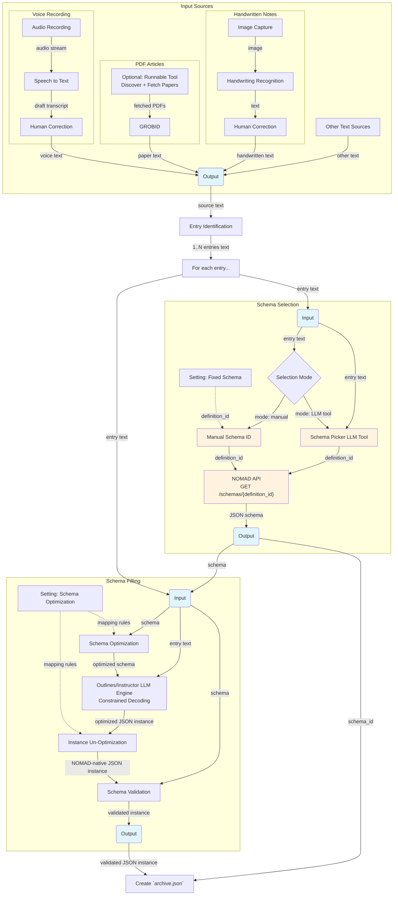

# NOMAD Data Parsing Pipeline

This document outlines the architecture for parsing data from various sources into NOMAD using LLM function calling to generate validated JSON documents.

## Pipeline Architecture



## Key Components

### Outlines/Instructor Integration
**Outlines** and **Instructor** are libraries that enable constrained decoding and structured output for LLMs, ensuring generated output always validates against specified schemas without manual validation or retry loops. Benefits:
- **Guaranteed valid JSON**: Output always matches the target schema structure
- **Reduced API calls**: No need for validation failures and retries
- **Flexible schema support**: Works with JSON schemas, Pydantic models, and grammar constraints
- **Performance**: Efficient constraint-guided generation

### Input Sources
- **Voice Recordings Sub-pipeline**: Audio recording -> speech to text -> human correction -> voice text
- **PDF Articles Sub-pipeline**: Optional runnable paper discovery/fetch tool -> PDF to text and GROBID -> paper text
- **Other Text Sources**: Any additional unstructured text data

### Data Processing
1. **Raw Text Data**: Text extracted/transcribed from various sources
2. **Entry Identification**: Source text is split into 1..N individual entry texts, each processed independently
3. **Outlines/Instructor LLM Engine**: Uses Outlines or Instructor to enforce structured generation with schema constraints, ensuring output always matches the optimized schema. Handles validation and retry logic automatically through constrained decoding.
4. **Instance Un-Optimization**: Reverse transforms the LLM-generated optimized JSON instance back to the NOMAD-native structure, using the same mapping rules applied during schema optimization.
5. **Schema Validation**: Validates the un-optimized instance against the original schema before producing the final output.
6. **Archive Creation**: Produces a NOMAD `archive.json` file from the validated instance together with the `schema_id` from schema selection.

### Schema Management
- **Schema Selection Options**:
    1. **Manual selection** by explicitly providing one or more `definition_id` values (uses a fixed schema setting)
    2. **LLM-based schema picker tool** that receives the entry text and infers one or more schema candidates, returning `definition_id` values
- **NOMAD API Integration**: Fetches JSON schema definitions dynamically from `GET /schemas/{definition_id}`
- **Optional Schema Optimization**: Applies reversible transformations (driven by mapping rules from the Schema Optimization setting) to simplify schema complexity for better extraction quality (e.g., flattening deep nesting, narrowing enums, adding helper aliases). The same mapping rules are also used during instance un-optimization.
- **Constraint Adaptation**: Converts optimized (or original) schemas to Outlines/Instructor-compatible constraints

### Validation & Storage
1. **LLM Output Instance(s)**: Guaranteed-valid JSON against the optimized schema (or original schema when optimization is skipped), produced per run
2. **Instance Un-Optimization**: Deterministic reverse mapping of generated instances back to the original NOMAD schema structure, using the mapping rules from the Schema Optimization setting
3. **Schema Validation**: The un-optimized instance is validated against the original schema to confirm structural correctness
4. **Archive Creation**: A NOMAD `archive.json` is assembled from the validated instance and the `schema_id` returned by schema selection
5. **RDM Database**: Final storage of the `archive.json` in the NOMAD research data management system

### Extraction Validation Utility
- **Purpose**: Validate extraction quality independently from runtime schema validation
- **Ground truth option 1**: Manually labeled input/output pairs
- **Ground truth option 2**: Synthetic benchmark data generated from automatically produced validated instances
- **Evaluation**: Compare predicted outputs against ground truth and compute metrics (field-level accuracy, unit-conversion correctness, missing/extra fields)
- **Feedback loop**: Use error analysis to improve prompts, schema optimization rules, and mapping rules

## Concrete Example: Unit-Aware Reversible Transform

### 1) Original NOMAD-oriented schema (fixed storage unit in V)
```python
original_schema = {
    "type": "object",
    "properties": {
        "voltage": {"type": "number"}
    },
    "required": ["voltage"]
}
```

### 2) LLM-optimized schema (value + unit)
```python
optimized_schema = {
    "type": "object",
    "properties": {
        "voltage": {
            "type": "object",
            "properties": {
                "value": {"type": "number"},
                "unit": {"type": "string", "enum": ["V", "mV", "kV"]}
            },
            "required": ["value", "unit"]
        }
    },
    "required": ["voltage"]
}
```

### 3) LLM output instance (optimized format)
```json
{
  "voltage": {
    "value": 340,
    "unit": "mV"
  }
}
```

### 4) Reverse transform to NOMAD-native instance
Conversion rule for `voltage` (target unit: V):

$$
	ext{voltage\_V} = \text{value} \times \text{factor(unit}\rightarrow\text{V)}
$$

For `340 mV`, factor is $10^{-3}$, so:

$$
340 \times 10^{-3} = 0.34\,\text{V}
$$

Result posted to NOMAD:
```json
{
  "voltage": 0.34
}
```

## Development Tasks

- [ ] Text extraction/transcription modules for each source type
- [ ] Manual schema selection input (pass-through `definition_id`)
- [ ] LLM schema picker tool (text -> `definition_id`)
- [x] NOMAD API client for schema retrieval
- [ ] Outlines integration with JSON schema constraints
- [ ] Reversible schema optimizer (original schema -> optimized schema + mapping rules)
- [ ] Reverse instance transformer (optimized instance -> NOMAD-native instance)
- [ ] Schema-to-Outlines constraint generator to convert selected schema (optimized/original) to Outlines format
- [ ] LLM model selection and prompt engineering for information extraction
- [ ] Round-trip tests (schema optimize/revert and instance transform/revert)
- [ ] Extraction validation utility (dataset runner + comparator)
- [ ] Manual ground-truth dataset format and labeling guidelines
- [ ] Synthetic benchmark generator from validated generated instances
- [ ] Quality metrics dashboard/report (accuracy, completeness, unit normalization)
- [ ] Integration tests with NOMAD API
- [ ] Performance optimization for batch processing
- [ ] Monitoring and logging for extraction quality


## Possible Folder structure
```text
pipeline/
├── __init__.py
│
├── config/                       # Maps to the "Settings" nodes
│   ├── __init__.py
│   ├── settings.py                # FIXED_SCHEMA & SCHEMA_TRANSFORM flags
│   └── prompts.yaml               # Store your LLM prompts safely away from code
│
├── input_sources/                 # Maps to Subgraph IS
│   ├── __init__.py
│   ├── voice_to_text.py           # Subgraph VR (Audio stream -> STT -> Human Correction)
│   ├── paper_to_text.py           # Subgraph PDF (Fetch Papers -> GROBID)
│   ├── handwritten_to_text.py     # Subgraph HW (Image Capture -> OCR -> Human Correction)
│   └── other_to_text.py            # Node OT (Other Text Sources)
│
├── processing/                    # Maps to the intermediary routing logic
│   ├── __init__.py
│   └── entry_identification.py    # Node EID (Splits source text -> 1..N entries)
│
├── schema_selection/              # Maps to Subgraph SS
│   ├── __init__.py
│   ├── manual_selector.py         # Node SSM (Fixed/Manual Schema ID logic)
│   ├── llm_picker.py               # Node SSP (Schema Picker LLM Tool)
│   └── nomad_client.py            # Node SSA (NOMAD API GET /schemas/{definition_id})
│
├── schema_filling/                # Maps to Subgraph SF
│   ├── __init__.py
│   ├── optimizer.py                # Node SFOP (Schema Optimization based on rules)
│   ├── llm_engine.py              # Node SFOE (Outlines/Instructor Constrained Decoding)
│   ├── unoptimizer.py             # Node IUM (Instance Un-Optimization / Mapping back)
│   └── validator.py                # Node SFV (Schema Validation)
│
└── export/                         # Maps to the final output node
    ├── __init__.py
    └── archive_writer.py          # Node AW (Create `archive.json` combining JSON & schema_id)

```
